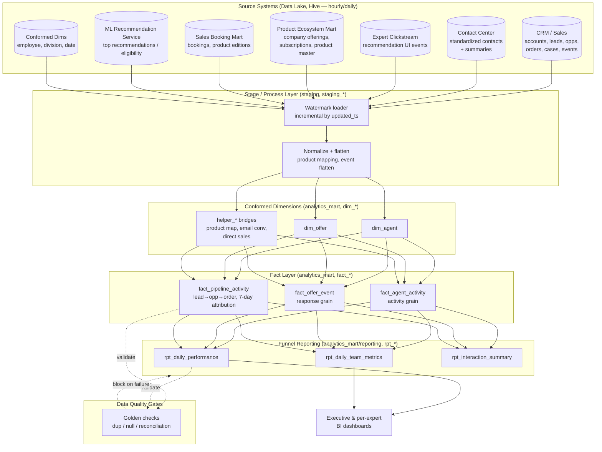
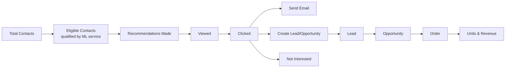

# Expert Recommendation & Conversion Data Foundation

> A production case study: the analytics data foundation behind an AI-guided, expert-assisted sales-and-retention program at Intuit. It stitches contact-center, CRM, clickstream, product-ecosystem, and sales-booking data into a single governed funnel — from *a recommendation made on a support call* all the way to *units and revenue booked days later* — so the business can finally measure, attribute, and optimize the program end to end.

> **Confidentiality note.** This is an anonymized account of a system I designed and built. Employer, internal project, product, system names are removed. **All schema, table, and column names in this repository are illustrative placeholders — not the real identifiers.** Scale and outcome figures are **representative** of production workloads at this scale, generalized to protect confidentiality. The code under [`examples/`](./examples/) is rewritten reference material that demonstrates the patterns — it is not the original source.

---

## TL;DR

- **Domain:** Tens of thousands of product-support/sales experts make AI-guided product recommendations to customers during support contacts. The program's hypothesis: the right recommendation at the right time lifts 30-day retention and product attachment without hurting handle time.
- **The data problem:** "Did a recommendation actually lead to a sale?" required joining a customer's support contact to a CRM lead, to an opportunity, to an order booked **up to 7 days later by a different agent** — across five source systems that share no common key and refresh on different cadences.
- **What I built:** A **declarative, config-driven Spark-on-EMR data foundation** — ~74 logical pipelines defined as configuration (not bespoke jobs), assembling conformed dimensions, fact tables, and a multi-stage funnel reporting mart, forked across **5–6 environments and up to 11 regional variants**.
- **The hard parts:** incremental ingestion with watermarking, idempotent CDC-style merge/upsert into history-preserving tables, **7-day cross-system conversion attribution**, product/SKU normalization across non-conforming CRM values, and data-quality gates that block bad data before it reaches executive dashboards.
- **Outcome:** A single source of truth for the recommendation→revenue funnel, powering daily executive and per-expert dashboards. The program it measures showed early-pilot lifts of **~1 pt in 30-day retention** and **~3–4 pts in feature adoption** with no measurable handle-time regression *(representative)*.

---

## 1. The Business Problem

Intuit runs a network of **tens of thousands of product experts** who handle **millions of customer interactions a year** *(representative)*. Historically these interactions were purely transactional: the customer calls with a problem, the expert solves it, the case closes.

The program reframed the interaction as *relational*. While resolving the issue, the expert is shown **AI-guided recommendations** — either a **Retention** play (an at-risk customer is nudged toward a feature that addresses their pain) or an **Attach** play (a low-risk customer is offered an adjacent product in the ecosystem: payments, payroll, time-tracking, and so on). If the customer is interested, the expert creates a CRM **lead**, warm-transfers to a sales expert, and the lead may convert to an **opportunity** and then an **order**.

The program's success depended on being able to answer questions the existing data could not:

- How many eligible contacts actually received a recommendation? How many were *viewed*, *clicked*, *acted on*?
- When a recommendation converted to revenue, **which expert and which recommendation get the credit** — given the sale closes days later, through a different team, in a different system?
- Where in the funnel are we leaking, by product, region, channel (phone vs chat), and recommendation type?

> The technical core was never "join some tables." It was **conformance and attribution across five systems that disagree on identity, granularity, and time** — materialized into a funnel that finance, sales, and the AI/ML team could all trust.

---

## 2. Why It Was Hard

| Challenge | Why it's hard | How the foundation solves it |
|---|---|---|
| **No shared key** | Contact-center contacts, CRM accounts/leads/opportunities, clickstream events, and the sales-booking mart each key on different identifiers. | A conformed entity layer maps `contact → company → expert → recommendation` via helper/bridge tables before any fact is built. |
| **7-day attribution window** | The sale closes later, booked by a *sales* expert, not the *care* expert who recommended. | Conversion fact attributes the booking to the **first** recommending agent within a 7-day window keyed on company + contact + product. |
| **Granularity mismatch** | Recommendation events are per click; bookings are per order line; contacts are per call. | Staged process tables normalize each source to a declared grain before fact assembly; merge keys are explicit per table. |
| **Non-conforming product values** | CRM free-text product names don't map cleanly to the canonical product/edition catalog. | A normalization transform (hundreds of `CASE WHEN` rules) collapses raw values → product family + edition, sourced once into a helper used mart-wide. |
| **Mixed refresh cadences** | Sources land hourly; some dimensions are daily; some are static seeds. | Per-pipeline watermarking on `updated_ts` decouples each table's incremental window from its neighbors. |
| **Multi-region, multi-environment** | The same logical funnel runs for US, Canada, UK, AU, and rest-of-world, across dev/e2e/perf/prod. | One transform definition, parameterized; environment and region are *configuration*, not copied code. |
| **Executive-grade trust** | These tables feed revenue dashboards; a silent dup or null is a credibility event. | Golden-check DQ gates (dup/null/reconciliation) run after every load and block promotion on failure. |

---

## 3. Architecture at a Glance



**Two things make this the *recommendation-funnel* foundation and not a generic medallion diagram:** (1) the **conversion fact implements a 7-day, first-touch attribution** across CRM and the sales mart, and (2) **data-quality golden checks are a gate, not a report** — a failed dup/null check blocks the reporting layer from publishing.

See [`architecture.md`](./architecture.md) for the full data flow, the declarative-config execution model, and sequence diagrams.

---

## 4. The Engineering Approach: Pipelines as Configuration

The defining decision (see [ADR-001](./adr/001-declarative-config-driven-pipelines.md)) was to **not** write ~74 bespoke Spark jobs. Instead, each pipeline is a set of **HOCON configuration files** interpreted at runtime by a generic Spark pipeline engine. A pipeline is a list of *steps*, each binding a step class to properties:

```hocon
pipeline {
  name  = "dim_agent"
  steps = [ RegisterUDFs, LoadSourcesWithWatermark, BuildFromSource, MergeUpsert ]
}
```

Each logical table is materialized as a **three-file set**:

| File | Role |
|---|---|
| `<name>.conf` | The pipeline definition: steps + the inline Spark SQL transform + merge config. |
| `<name>_<env>.conf` | Environment binding: includes the shared base, sets `variables{}` (schemas, target table, S3 path) and per-pipeline `spark-properties{}`. |

This is what let one transform definition fan out to **5–6 environments × up to 11 regional variants** without copy-paste. Adding a region is a new binding file, not a new job. See [`examples/`](./examples/) for a complete, anonymized three-file pipeline plus its DQ checks.

---

## 5. Core Patterns

**Incremental load via watermarking.** Every fact/dim reads only rows newer than its own target's max `updated_ts`, staged into a `stg_*` view. No full rescans of multi-million-row sources on each run. ([ADR-002](./adr/002-watermark-incremental-merge-upsert.md))

**Idempotent CDC-style merge/upsert.** A merge operator upserts the staged delta into history-preserving target tables keyed on an explicit business key, writing partitioned Parquet to S3 (`rundatetime=` partitions, dynamic partition overwrite). Re-running a day is safe. ([ADR-002](./adr/002-watermark-incremental-merge-upsert.md))

**Multi-region config forking.** Region is a suffix and a `variables{}` value, never a forked transform. ([ADR-003](./adr/003-multi-region-config-forking.md))

**Data quality as a gate.** Dup, null, and reconciliation golden checks run after each load; a failing check (e.g. duplicate business keys > 0) returns `0` and blocks promotion. ([ADR-004](./adr/004-data-quality-gates.md))

**Resource profiles tuned for large joins.** Fact pipelines run with large executors, AQE + skew-join enabled, broadcast disabled in favor of AQE broadcast, and 2,000 shuffle partitions — because the conversion fact joins the multi-million-row sales-booking mart. See [Spark resource profiles](./architecture.md#7-resource-profiles) in architecture.md.

---

## 6. The Funnel & Attribution

The funnel the foundation measures, stage by stage:



Key metric definitions and the attribution rule are documented in [`design/funnel-metrics.md`](./design/funnel-metrics.md). The headline: **a conversion is attributed to the first advisor who made the qualifying recommendation, if the order books within 7 days of the contact** — pattern described in [`examples/`](./examples/).

---

## 7. Scale & Shape *(representative)*

| Dimension | Figure |
|---|---|
| Logical pipelines | ~74 (config / dim / helper / fact / reporting layers) |
| Config files | ~440 across environments and regions |
| Environments × regions | 5–6 × up to 11 |
| Source tables integrated | ~30 across 7 source systems |
| Heaviest source (sales bookings) | ~12M rows/day |
| Conversion fact volume | ~5M rows/day |
| Recommendation/clickstream volume | ~2M rows/day |
| Refresh cadence | Hourly sources → daily mart build |
| Executor profile (facts) | ~50 GB memory, 15 cores, off-heap on, 2,000 shuffle partitions, AQE + skew join |

---

## 8. My Role & Impact

I was the data engineer who designed and built this foundation end to end — embedded within a product and analytics organization as the technical owner of the data layer. The work was mine: the config-driven pipeline pattern, the conformed dimensional model, the fact and funnel reporting layers, the 7-day attribution logic, the multi-region/multi-environment parameterization, and the data-quality gating. I partnered with product managers, analytics engineers, and the AI/ML team to translate business questions into data model decisions, and with platform engineers for compute and infrastructure.

The dashboards built on this foundation served **100+ stakeholders** across product, analytics, operations, and leadership — feeding both executive revenue reporting and per-expert performance views used daily by the program's business owners.

**Impact** *(representative)*:

- Delivered the **single source of truth** for the recommendation→revenue funnel, replacing ad-hoc spreadsheets and one-off queries with governed, daily-refreshed marts feeding executive and per-expert dashboards.
- Made **revenue attribution auditable** — every booked unit traces back to a contact, an expert, a recommendation, a region, and a channel.
- Enabled the AI/ML team to **close the loop**: recommendation responses flow back as labeled training signal.
- Built the foundation to **fan out to new regions and products as configuration**, turning a multi-week "new market" project into a config change plus DQ validation.
- Aligns with my broader track record: **60+ production Spark pipelines**, **40% runtime improvement** and **30% compute cost reduction** at this scale, **$50K+/yr** cloud savings, and **70% faster incident resolution** via the companion monitoring system *(representative; see [profile](../profile/README.md))*.

---

## 9. Repository Layout

```
enterprise-data-foundation/
├── README.md                     # this case study
├── architecture.md               # deep architecture + data flow + sequences
├── tradeoffs.md                  # the decisions and what they cost
├── adr/                          # architecture decision records
│   ├── 001-declarative-config-driven-pipelines.md
│   ├── 002-watermark-incremental-merge-upsert.md
│   ├── 003-multi-region-config-forking.md
│   └── 004-data-quality-gates.md
├── design/
│   ├── data-model.md             # conformed dims, facts, reporting marts
│   ├── source-to-target.md       # source systems → target tables mapping
│   └── funnel-metrics.md         # metric definitions + attribution rule
├── examples/                     # pipeline + DQ pattern documentation (no runnable code)
│   └── README.md                 # three-file pattern, four-step execution, DQ pattern
└── docs/
    ├── operational-runbook.md
    └── results.md
```

---

## 10. Companion: Pipeline Health Monitor

The mart build is monitored proactively by a separate system: a custom `SparkListener` that predicts failure risk mid-execution using LightGBM and delivers a Claude-powered root cause advisory before the job fails.

See [pipeline-health-monitor](../pipeline-health-monitor/) for the full architecture.

---

## 11. Related Portfolio Work

- The abstract pattern behind this system: [CDC](../data-platform-reference-architecture/architectures/cdc/) and [Customer 360](../data-platform-reference-architecture/architectures/customer360/) reference architectures.
- The Spark tuning that makes the fact joins viable: [spark-performance-playbook](../spark-performance-playbook/).
- The data-quality and observability thinking: [data-engineering-playbook → data-quality](../data-engineering-playbook/data-quality/) and [→ observability](../data-engineering-playbook/observability/).

---

<sub>Anonymized production case study · Apache Spark on EMR · declarative config-driven pipelines · lakehouse · dimensional modeling · funnel attribution</sub>
