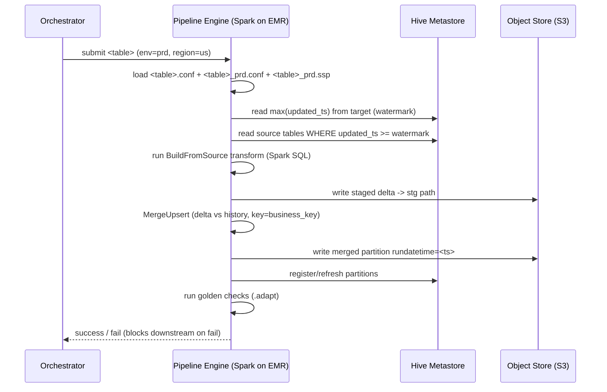
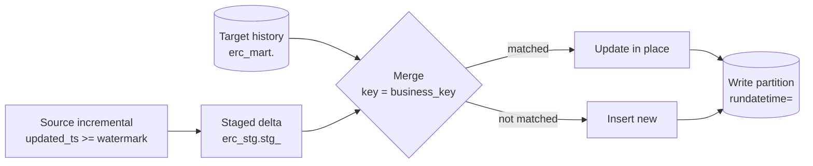
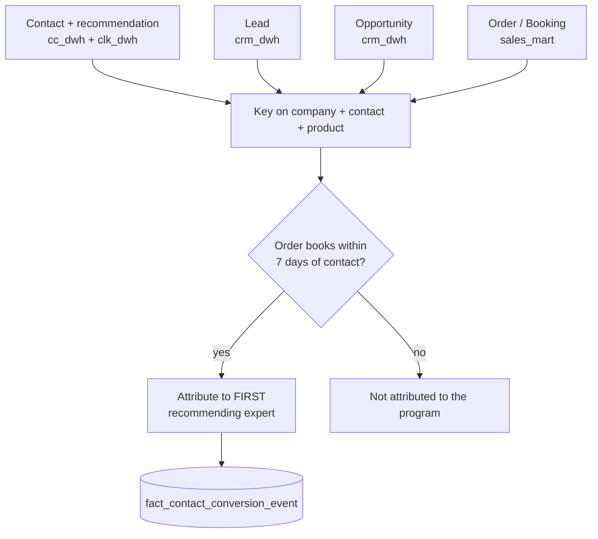
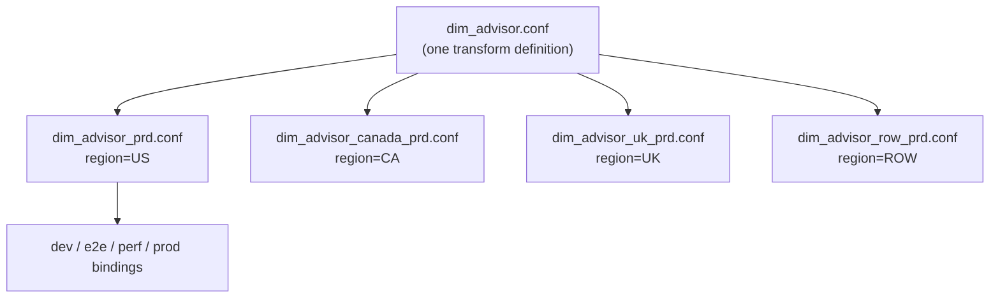

# Architecture — Expert Recommendation & Conversion Data Foundation

> **Anonymized.** All schema, table, column, package, and bucket names below are illustrative placeholders, not real identifiers. Figures are representative.

This document goes a layer deeper than the [README](./README.md): the layered data model, the declarative execution model, the incremental + merge mechanics, and how attribution and data quality are enforced.

---

## 1. Layered Data Model

The foundation follows a layered (medallion-style) model, but the layers are named by *function* rather than bronze/silver/gold because the mart is purpose-built for one funnel:

```mermaid
flowchart LR
    subgraph L0["Sources (read-only, Hive on Data Lake)"]
        direction TB
        S1[crm_dwh.*]
        S2[cc_dwh.*]
        S3[clk_dwh.*]
        S4[eco_mart.*]
        S5[sales_mart.*]
        S6[ml_reco.*]
        S7[dim_dwh.*]
    end
    subgraph L1["Process / Stage — erc_stg, prc_*"]
        P1[prc_advisor_clickstream]
        P2[prc_recommendation_event_flat]
        P3[prc_advisor_contact_mapping]
    end
    subgraph L2["Conformed Dimensions — erc_mart, dim_/cfg_/helper_"]
        D1[dim_advisor]
        D2[dim_recommendation]
        C1[cfg_pilot_advisors]
        C2[cfg_sales_queue]
        H1[helper_product_map]
        H2[helper_email_conversion]
    end
    subgraph L3["Facts — erc_mart, fact_*"]
        F1[fact_advisor_contact_attribute]
        F2[fact_recommendation_event]
        F3[fact_contact_conversion_event]
    end
    subgraph L4["Reporting — erc_rpt, rpt_*"]
        R1[rpt_recommendation_funnel_daily]
        R2[rpt_recommendation_advisor_funnel_daily]
        R3[rpt_recent_recommendation_response]
    end
    L0 --> L1 --> L2 --> L3 --> L4
```

| Layer | Prefix | Purpose | Refresh |
|---|---|---|---|
| Process / stage | `prc_` | Source-aligned cleansing, flattening, grain normalization | Daily (incremental) |
| Config / seed | `cfg_` | Analyst-curated lookups (pilot experts, sales-queue attributes) | Static / on change |
| Dimension | `dim_` | Conformed entities (expert, recommendation) | Daily |
| Helper / bridge | `helper_` | Cross-system mappings (product normalization, email→conversion) | Daily |
| Fact | `fact_` | Event/transaction grain (activity, response, conversion) | Daily |
| Reporting | `rpt_` | Pre-aggregated funnel marts for BI | Daily |

Dependency ordering is **implicit in the layer prefixes** (`prc_ → dim_/helper_ → fact_ → rpt_`) and explicit within a pipeline via step order. The orchestrator (external to this config repo) builds a DAG from declared upstream-table dependencies.

---

## 2. Declarative Execution Model

A pipeline is **data, not code**. A generic Spark engine (`com.platform.spark.pipeline.*`) reads a HOCON config and executes its `steps` in order. The same engine runs all ~74 pipelines; the config is what differs.

### The four canonical steps

| Step (logical) | Engine class (illustrative) | Responsibility |
|---|---|---|
| `RegisterUDFs` | `com.platform.spark.udf.UdfRegistry` | Register surrogate-key (`uuid()`) and PII tokenization UDFs |
| `LoadSourcesWithWatermark` | `com.platform.pipeline.PredicateSubQueryExecutor` | Compute watermark, push down incremental predicate, register source views |
| `BuildFromSource` | `com.platform.spark.pipeline.SparkLoaderStep` | Execute the inline transform SQL into a staged view |
| `MergeUpsert` | `com.platform.pipeline.customsteps.MergeOperator` | Upsert staged delta into target, keyed on business key |

The pattern is documented in [`examples/`](./examples/).

---

## 3. Incremental Load + Merge Mechanics

### Watermarking

Each pipeline computes its own watermark from its **own target table**, so pipelines are independent and a slow upstream never forces a full rescan downstream.

The watermark is `MAX(updated_ts)` from the target (defaulting to a base date on first run). It is injected as a predicate on the source read so only rows newer than the last merged state are scanned. Because each pipeline self-watermarks, re-ordering pipelines or retrying a single failure never causes a full-table rescan.

### Merge / upsert

The staged delta is merged into a history-preserving target keyed on an explicit business key. Re-running a day is **idempotent**: the same rows resolve to the same merge result.

Output is partitioned Parquet under `s3://org-erc-processing-<region>-<env>/erc_mart.db/<table>/rundatetime=<ts>/` with **dynamic partition overwrite** (`spark.sql.sources.partitionOverwriteMode=dynamic`), so a re-run replaces only the affected partitions.

---

## 4. Attribution: the Conversion Fact

`fact_contact_conversion_event` is the analytically hardest table. It answers: *which expert and recommendation get credit for a booked order?*

Rules encoded in the transform:

1. **Join path:** contact → lead → opportunity → order, conformed via `helper_product_map` so CRM free-text products line up with the canonical product/edition.
2. **Window:** the order must book within **7 days** of the originating contact.
3. **First-touch:** if multiple recommendations precede the order, credit the **first** qualifying expert/recommendation.
4. **Grain:** one row per (company, contact, product, order) with funnel-stage flags (`viewed_flag`, `clicked_flag`, `email_flag`, `opportunity_flag`).

See [`design/funnel-metrics.md`](./design/funnel-metrics.md) for metric definitions and [`examples/`](./examples/) for the attribution pipeline pattern.

---

## 5. Data Quality as a Gate

Every pipeline ships a `.adapt` manifest pointing at **golden-check SQL**. Checks run after the load and return `1` (pass) or `0` (fail); a failure **blocks promotion** of the table to the reporting layer rather than merely logging a warning.

| Check type | Question | Example |
|---|---|---|
| Duplicate | Is the business key unique at declared grain? | dup_check golden query → returns 0 if dupes exist |
| Null | Are required columns populated? | null_check golden query → returns 0 if required cols are null |
| Reconciliation | Do funnel counts tie to the source-of-truth sales mart? | conversion vs booking totals |

A failing dup check on a revenue-feeding fact is treated as a release-blocking defect — see [ADR-004](./adr/004-data-quality-gates.md).

---

## 6. Multi-Region / Multi-Environment

The same transform definition runs for multiple geographies and environments. Region and environment are **configuration**, expressed as filename suffixes and `variables{}` values — never forked SQL.

Adding a region is a new binding file + DQ validation, not a new pipeline. This is the single biggest leverage point of the design — see [ADR-003](./adr/003-multi-region-config-forking.md).

---

## 7. Resource Profiles

Fact pipelines join multi-million-row sources (the sales-booking mart alone is ~12M rows/day), so resource profiles are tuned per pipeline in the env-binding `spark-properties{}` and `.ssp`:

| Knob | Fact value (illustrative) | Why |
|---|---|---|
| `spark.executor.memory` / `memoryOverhead` | 50G / 30G | Wide joins + large shuffle |
| `spark.memory.offHeap.enabled` / `.size` | true / 10G | Reduce GC pressure on big shuffles |
| `spark.sql.shuffle.partitions` | 2000 | Avoid giant shuffle partitions on the conversion join |
| `spark.sql.adaptive.enabled` | true | Coalesce post-shuffle partitions at runtime |
| `spark.sql.adaptive.skewJoin.enabled` | true | Split skewed contact/company keys |
| `spark.sql.autoBroadcastJoinThreshold` | -1 (use AQE broadcast) | Avoid driver OOM from auto-broadcast misfires |

The reasoning behind these knobs is documented topic-by-topic in the [spark-performance-playbook](../spark-performance-playbook/).

---

## 8. Failure Modes & Mitigations

| Failure mode | Detection | Mitigation |
|---|---|---|
| Upstream source late/missing | Watermark advances little or not at all; freshness check | Pipeline no-ops safely; alert on stale watermark |
| Duplicate business keys | `*_dup_check.sql` returns 0 | Block promotion; investigate source dup or merge-key error |
| Skewed contact/company keys | Straggler tasks in Spark UI | AQE skew-join split; salting on known hot keys |
| Schema drift in CRM source | Job fails on missing/renamed column | Contract expectation in transform; fail fast, no silent null fill |
| Attribution double-count | Reconciliation check vs sales mart | First-touch + 7-day window enforced in SQL; recon gate |
| Partition explosion | Metadata growth; long commit times | Dynamic overwrite scoped to `rundatetime`; periodic compaction |

---

## 9. What I Would Build Next

- **Move targets to an open table format (Iceberg/Delta)** for ACID merges, time-travel, and hidden partitioning instead of `rundatetime=` directories — see the [lakehouse reference architecture](../data-platform-reference-architecture/architectures/lakehouse/).
- **Streaming the recommendation-response loop** so the AI/ML team gets labels in minutes, not next-day — see [streaming](../data-platform-reference-architecture/architectures/streaming/).
- **Declarative data contracts** on CRM sources to turn schema drift into a producer-side CI failure rather than a consumer-side 3 AM page.
- **Config linting + generation** so a new region/product is generated and validated from a single spec.
