# Data Model — Conformed Dimensions, Facts, Reporting Marts

> Anonymized. All schema/table/column names are illustrative placeholders. Figures are representative.

The foundation is a purpose-built dimensional model for the recommendation→conversion funnel. It is not a general warehouse; every table earns its place in the funnel.

## Entity-Relationship Overview

```mermaid
flowchart LR
    subgraph stage["Stage (erc_stg)"]
        prc_advisor_clickstream
        prc_recommendation_event_flat
        prc_advisor_contact_mapping
    end
    subgraph conformed["Conformed (erc_mart)"]
        dim_advisor
        dim_recommendation
        cfg_pilot_advisors
        helper_product_map
    end
    subgraph facts["Facts (erc_mart)"]
        fact_advisor_contact_attribute
        fact_recommendation_event
        fact_contact_conversion_event
    end
    subgraph reporting["Reporting (erc_rpt)"]
        rpt_recommendation_funnel_daily
        rpt_recommendation_advisor_funnel_daily
        rpt_recent_recommendation_response
    end
    stage --> conformed --> facts --> reporting
```

## Tables by Layer

### Process / stage (`erc_stg.prc_*`)
| Table | Grain | Notes |
|---|---|---|
| `prc_advisor_clickstream` | one row per UI event | Flattened recommendation-panel clickstream |
| `prc_recommendation_event_flat` | one row per recommendation response | Exploded nested event payload |
| `prc_advisor_contact_mapping` | one row per (expert, contact) | Bridges contact-center contacts to experts |

### Config / seed (`erc_mart.cfg_*`)
| Table | Grain | Notes |
|---|---|---|
| `cfg_pilot_advisors` | one row per expert | Analyst-curated: who is live on the panel, trained, in an incentive group |
| `cfg_sales_queue` | one row per queue | Sales-queue attributes for routing/attribution |

### Dimensions (`erc_mart.dim_*`)
| Table | Grain | Key |
|---|---|---|
| `dim_advisor` | one row per expert (current) | `advisor_key` |
| `dim_recommendation` | one row per recommendation offer | `recommendation_key` |

### Helpers / bridges (`erc_mart.helper_*`)
| Table | Purpose |
|---|---|
| `helper_product_map` | Map CRM free-text product → canonical product family + edition |
| `helper_email_conversion` | Link "send email" actions to downstream conversions |

### Facts (`erc_mart.fact_*`)
| Table | Grain | Measures |
|---|---|---|
| `fact_advisor_contact_attribute` | one row per expert-contact activity | activity counts |
| `fact_recommendation_event` | one row per recommendation response | viewed/clicked/interested flags |
| `fact_contact_conversion_event` | one row per (company, contact, product, order) | units, revenue, funnel-stage flags |

### Reporting (`erc_rpt.rpt_*`)
| Table | Grain | Consumer |
|---|---|---|
| `rpt_recommendation_funnel_daily` | day × product × region × channel × type | Executive funnel dashboard |
| `rpt_recommendation_advisor_funnel_daily` | day × expert | Per-expert performance / incentives |
| `rpt_recent_recommendation_response` | recent responses | Operational / near-real-time view |

## Conformance Rules

- **Product** is conformed exactly once in `helper_product_map` and reused everywhere; no transform re-implements product mapping.
- **Expert** identity is conformed in `dim_advisor` with `trained_flag` / `incentive_group_flag` used as filters in downstream facts.
- **Date** is conformed via a shared date dimension (fiscal-calendar aware) so funnel windows respect fiscal periods.
- **Region** is both a column and a pipeline parameter (see [ADR-003](../adr/003-multi-region-config-forking.md)).

## Partitioning & Retention

- Facts/reporting partitioned by `contact_date` (and physically by `rundatetime=` on write).
- Retention aligns to the downstream sales mart's window; reprocessing of older fiscal years is bounded by source retention (documented as an explicit constraint, not a surprise).
