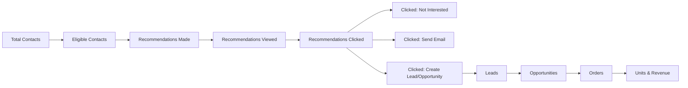

# Funnel Metrics & Attribution

> Anonymized. Metric names are illustrative; definitions reflect the real funnel logic.

This document defines the funnel metrics the mart computes and the attribution rule that ties a booked order back to a recommendation. These definitions are the contract between data engineering, sales analytics, and finance.

## The Funnel

## Agent / Expert Metrics

| Metric | Definition |
|---|---|
| **Total Contacts** | Unique inbound contacts handled by an expert |
| **Eligible Contacts** | Inbound contacts qualified for a recommendation by the ML service |
| **Total Recommendation Count** | Unique recommendations suggested for a (customer, product) |
| **Viewed Count** | Unique recommendations with `viewed_flag = 1` |
| **Clicked – Not Interested** | Unique recommendations with `not_interested_flag = 1` |
| **Clicked – Create Opportunity** | Unique recommendations with `opportunity_flag = 1` |
| **Clicked – Send Email** | Unique recommendations with `email_flag = 1` |

## Funnel / Conversion Metrics

| Metric | Definition |
|---|---|
| **Attach Conversion Rate** | `Total Recommendation Count / Eligible Contacts` |
| **Units Won (Closed)** | Count of unique opportunities with status `Closed Won` |
| **Revenue** | `unit_price × units` for attributed bookings |
| **Retention Lift** | 30/60/90-day retention of recommended vs. comparable non-recommended cohorts |

## Attribution Rule

> A conversion is attributed to the **first** expert who made a qualifying recommendation, **if the order books within 7 days** of the originating contact.

Encoded as:

1. Identify qualifying recommendations (eligible contact, recommendation viewed/clicked) keyed on `company + contact + product`.
2. Find bookings in the sales mart for the same `company + product` with `booking_date BETWEEN contact_date AND contact_date + 7`.
3. Where multiple qualifying recommendations precede a booking, keep the **earliest** (first-touch).
4. Attribute `units` and `revenue` to that expert/recommendation.

### Why first-touch + 7 days

- **First-touch** matches how the program credits experts for initiating the relationship.
- **7-day window** balances capturing genuine recommendation-driven conversions against attributing unrelated later purchases. It is a **business assumption** documented here so it can be revisited — see the tradeoff in [tradeoffs.md](../tradeoffs.md).

## Cuts / Dimensions

The funnel is analyzable by: **product, product family, expert, expert division, contact channel (phone/chat), region, customer, and recommendation type (Attach/Retention)**.

## Known Caveats

- Multi-expert journeys are undercounted by first-touch.
- The 7-day window can miss longer consideration cycles for higher-consideration products.
- Reconciliation tolerance vs. the sales mart is non-zero by design (timing differences); the tolerance is documented and monitored.
