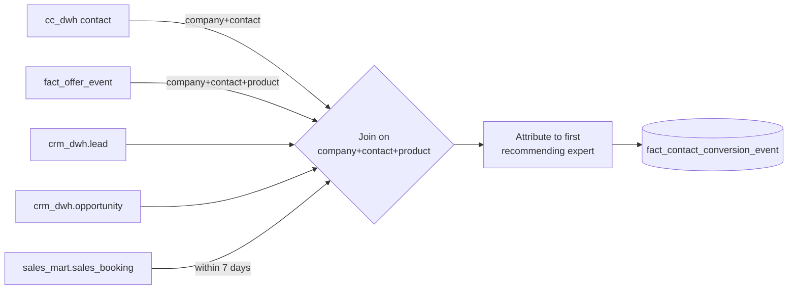

# Source-to-Target Mapping

> Anonymized. Source/target names, schemas, and volumes are illustrative placeholders / representative figures.

How seven source systems feed the funnel mart. The point of this document is to make explicit *which system is authoritative for what*, and *how granularity and identity are reconciled* before any fact is built.

## Source Systems

| Source (placeholder) | Represents | Refresh | Peak vol/day *(rep.)* |
|---|---|---|---|
| `crm_dwh` | CRM / sales platform — accounts, leads, opportunities, orders | hourly | ~230K combined |
| `cc_dwh` | Contact-center platform — contacts, summaries, routing | hourly | ~240K |
| `clk_dwh` | Recommendation-panel clickstream (viewed / clicked / dismissed) | hourly | ~10K |
| `eco_mart` | Product-ecosystem mart — company subscriptions, offerings | daily | ~82K |
| `sales_mart` | Sales-booking mart — **source of truth for revenue** | hourly | ~12M |
| `ml_reco` | ML recommendation service — top-N offers, eligibility scores | static/periodic | — |
| `dim_dwh` | Conformed enterprise dimensions — employee, division, date | daily | ~390K employees |

## Mapping Summary

| Target table | Primary source(s) | Conformance / join logic |
|---|---|---|
| `dim_agent` | `dim_dwh.employee` + `dim_dwh.division` + `cfg_pilot_advisors` | Resolve expert → division; flag trained / incentive-group experts |
| `dim_offer` | `source_mart.top_offers` + `helper_product_map` | Recommendation offer → product family/edition; type = Attach/Retention |
| `prc_advisor_clickstream` | `clk_dwh.recommendation_ui_events` | Flatten UI event payload to one row per event |
| `staging.offer_event_flat` | CleanEntity recommendation event map | Explode nested response payload to response grain |
| `fact_offer_event` | `staging.offer_event_flat` + `dim_offer` | Response grain with viewed/clicked/interested flags |
| `fact_agent_activity` | `contact_dwh.contact_standardized` + `dim_agent` | Activity grain per expert-contact |
| `fact_contact_conversion_event` | `cc_dwh` + `crm_dwh.lead/opportunity/order` + `sales_mart.sales_booking` + `helper_product_map` | **7-day first-touch attribution** (see below) |
| `rpt_conversion_funnel_daily` | the three facts | Pre-aggregate to day × product × region × channel × type |

## The Attribution Join (conversion fact)

Authority rules:
- **`sales_mart` is authoritative for revenue/units** — the conversion fact never invents a booking; it attributes an existing one.
- **CRM is authoritative for the lead→opportunity path.**
- **`helper_product_map` is the single authority for product normalization** — every join that touches product uses it.

## Reconciliation

A nightly reconciliation check compares `SUM(units/revenue)` in `fact_contact_conversion_event` against the authoritative `sales_mart` totals (filtered to attributable bookings) within tolerance. A breach blocks the reporting publish ([ADR-004](../adr/004-data-quality-gates.md)).
